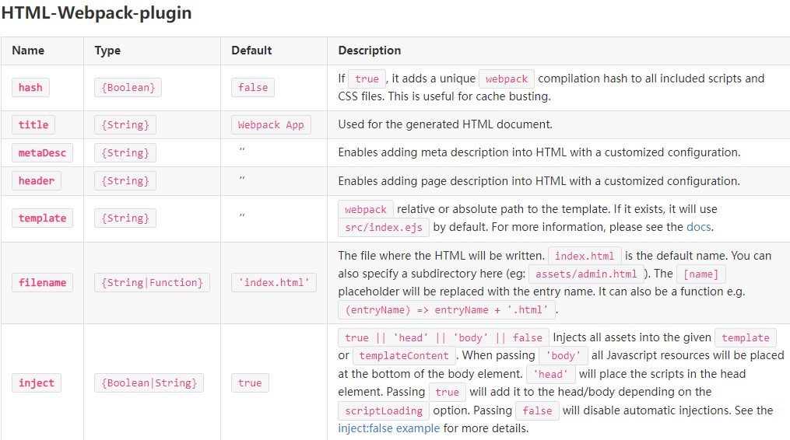
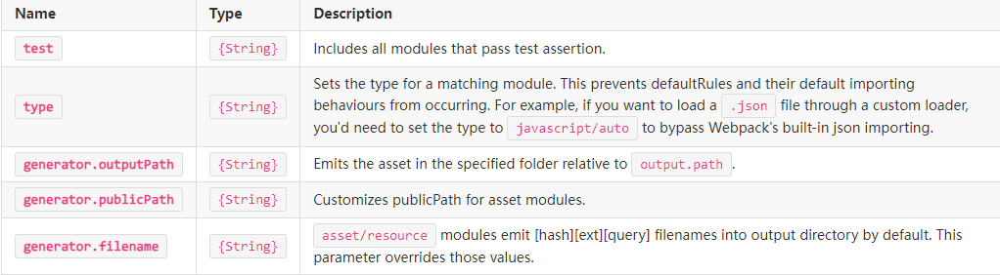

установкf необходимых пакетов, которые помогут нам внедрить Webpack

npm install webpack webpack-cli html-webpack-plugin --save-dev
Copied!Executed!
Где:

webpack является сборщиком модулей. Его основная цель — объединять файлы JavaScript для использования в браузере, но он также способен преобразовывать, объединять или упаковывать практически любой ресурс или актив.
webpack-cli предоставляет разработчикам гибкий набор команд для увеличения скорости при настройке пользовательского проекта Webpack.
html-webpack-plugin упрощает создание HTML-файлов для обслуживания пакетов Webpack.
Вы также заметите два новых файла, созданных в структуре каталогов и .package.jsonpackage-lock.json

package.json содержит важную информацию о проекте. Он содержит как удобочитаемые метаданные о проекте, такие как имя и описание проекта, так и функциональные метаданные, такие как номер версии пакета и список зависимостей, необходимых приложению.

package-lock.json автоматически генерируется для любых операций, в которых npm изменяет либо дерево, либо . Он описывает точное дерево, которое было создано, что позволяет последующим установкам создавать идентичные деревья независимо от промежуточных обновлений зависимостей.node_modulespackage.json

Let's run the following command, which will take our script at src/index.js as the entry point and will generate dist/main.js as the output. The npx command, which ships with Node 8.2/npm 5.2.0 or higher, runs the Webpack binary (./node_modules/.bin/webpack) of the Webpack package we installed in the beginning.

npx webpack

Let's host the output from Webpack using python server. First, you need to go to the dist directory (in the Terminal).

cd dist

[//]: # (python3 -m http.server)

But where is our output HTML?

Let's add the required configuration for Webpack!

В корневом каталоге нашего проекта нам нужно создать со следующей конфигурацией:webpack.config.js

Mode
Using the mode configuration option instructs Webpack to use its built-in optimizations appropriately.

Defaults to production, possible values are: none, development, and production.

Please see the docs for more details.

Output
The top-level output key contains a set of options that tell Webpack how and where to output bundles, assets, and anything else bundled or loaded with Webpack.

output.clean
If set to true, it will clean the output directory before emit.

Please see the docs for more details.

Module
These options determine how the different types of modules within a project will be treated.

